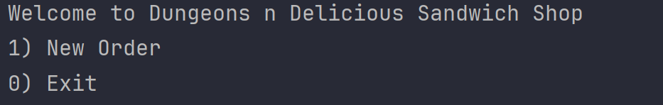
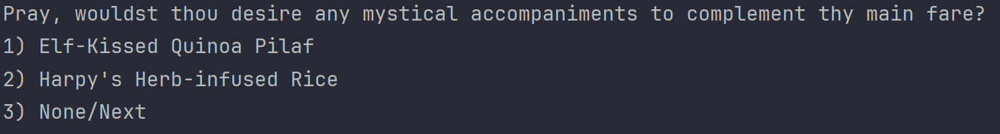

# Dungeons-n-Delicious-Sandwich-Shop - Java CLI Point of Sales Application
## Overview:
DND Sandwich Shop POS is a custom application developed in Java. This project addresses the need to automate the order process for DND, a growing sandwich shop that allows customers to fully customize their sandwich orders. The application is designed as a command-line interface (CLI) and follows Object-Oriented Analysis and Design principles.

## Key Features:
Customization Options:
## Home Screen:
### Here are users are greeted with this Home Screen.

### Customers can order sandwiches in three sizes (4", 8", and 12").

### Choose from various types of bread.

### Choose from various types of meats.

### Add extra meat with an additional cost.

### Choose from various types of cheese.

### Add extra cheese with an additional cost.

### Specify whether the sandwich should be toasted.

### Customize toppings.

### Selection of sauces.

### Selection of sides.

### Order Management:

#### Customers can place an order with one or more sandwiches.
#### Each sandwich is customizable, allowing for a personalized experience.
#### Drinks and chips can be added to the order.

### Our drink selection.

### Our chip selection. 

### User can remove an item from their order.

### User can cancel order.

### Order Display and Receipts:
The application displays order details, including the list of sandwiches with toppings.
Shows the total cost of the order.

### When the order is completed, a receipt file is generated and saved with a timestamp.

#### User will be greeted with the following prompt.
### A new receipt file will be created.

## Technical Details:
Object-Oriented Design:
The project leverages Object-Oriented Analysis and Design principles.
Classes and interfaces are used to structure the solution, promoting modularity and maintainability.

## Project Setup:
The codebase is hosted on GitHub, providing a collaborative environment for team members.
A project board on GitHub is utilized for managing tasks and tracking progress.

## User Interaction:
The application employs a user-friendly CLI with a series of screens for order creation and management.
Options are provided to navigate through the ordering process, and user input is validated.

## Flexibility and Extensibility:
The code is structured to accommodate future enhancements, such as online order capabilities.

## Class Diagram:

## How to Use:
1. Clone the Repository:
Team members can easily clone the project repository to their local machines.

2. Run the Application:
The application can be executed by running the java com.pluralsight.Main command.
User Interaction:

3. Users navigate through a series of screens (Home, Order, Add Sandwich, Add Drink, Add Chips, Checkout) to create and manage orders.

## Contribution Guidelines:
Collaborative Development:
The project encourages collaboration through forking, creating feature branches, and submitting pull requests.
### Our favorite piece of code that we wrote:
#### Joshua:

This piece of code creates a string with the variable fileName and I included the file path where its going to be at.
Then I concatenate the local date and time while inserting into the time formatter that was created earlier on in
the class. In the next line we will be creating that file with a bufferedWriter, using a BufferedWriter allows to it
be more precise.

#### Paul:

Input validation is a very important practice in creating robust and user-friendly programs. The above code segment uses a switch statement to handle user input for selecting the size of a sandwich. The while loop prompts the user until a valid size (1, 2, or 3) is entered. This validation is crucial for preventing errors, enhancing the user experience by guiding them to correct inputs, so that the code that is likely dependent on the validated input, executes accurately.

#### Angel: 

#### Jake:

This luxurious piece of code allows for objects to have String implementations. I like to follow a simple path: K.I.S.S.
It means "Keep It Simple, Stupid" and the toString() override makes output statements as simple as calling the object and
the toString() method applied to the object.
## Conclusion:
DND Sandwich Shop POS is not just a Java CLI application; it represents a thoughtfully designed solution that enhances the customer experience at a sandwich shop. Its user-friendly interface, and collaborative development approach make it a valuable asset for DND as it continues to grow and innovate in the food industry.
